# JetStream Bridge Examples

This directory contains comprehensive Rails 7 example applications demonstrating how to sync data between systems using the JetStream Bridge library over NATS JetStream.

## Overview

Two complete example applications are provided, each demonstrating a different deployment model:

1. **[Non-Restrictive Environment](non_restrictive/)** - Development-friendly setup with auto-provisioning
2. **[Restrictive Environment](restrictive/)** - Production-ready setup with manual provisioning

Both examples implement the same domain model and sync functionality, but differ in their infrastructure setup and permissions model.

## Quick Comparison

| Feature | Non-Restrictive | Restrictive |
|---------|----------------|-------------|
| **Setup Complexity** | Simple | Moderate |
| **Auto-Provisioning** | ✅ Enabled | ❌ Disabled |
| **Infrastructure Steps** | 1 (start all) | 2 (provision, then start) |
| **App Permissions** | Full admin | Limited (read/write only) |
| **Best For** | Development, testing | Production, compliance |
| **Deployment Model** | Self-configuring apps | Infrastructure-as-code |

## Simplified Configuration

Both Rails examples now share a tiny initializer powered by `JetstreamBridge::ConfigHelpers`:

```ruby
require 'jetstream_bridge/config_helpers'

JetstreamBridge::ConfigHelpers.configure_bidirectional(
  app_name: 'system_a',
  destination_app: 'system_b',
  mode: :non_restrictive # or :restrictive
)

JetstreamBridge::ConfigHelpers.setup_rails_lifecycle
```

This replaces ~40 lines of duplicate setup while keeping the same defaults.

## Architecture

Both examples implement a **Bidirectional Publisher-Consumer** pattern where each system can both publish and consume events:

```mermaid
flowchart LR
  subgraph A["System A\nPublisher + Consumer\n- Organizations\n- Users\nSyncs from B\nWrite API\nDB: system_a_db"]
  end

  subgraph JS["NATS JetStream\nStream: sync-stream\nSubjects:\n- system_a.sync.system_b (A→B)\n- system_b.sync.system_a (B→A)"]
  end

  subgraph B["System B\nPublisher + Consumer\n- Organizations\n- Users\nSyncs from A\nWrite API\nDB: system_b_db"]
  end

  A -->|publish system_a.sync.system_b| JS
  JS -->|deliver system_a.sync.system_b| B
  B -->|publish system_b.sync.system_a| JS
  JS -->|deliver system_b.sync.system_a| A
```



## Domain Model

Both systems sync two entities:

### Organization

- `id` (primary key)
- `name` (string)
- `domain` (string, unique)
- `active` (boolean)
- `created_at`, `updated_at`

### User

- `id` (primary key)
- `organization_id` (foreign key)
- `name` (string)
- `email` (string, unique)
- `role` (string)
- `active` (boolean)
- `created_at`, `updated_at`

## Event Flow

Both systems can create/update data that syncs bidirectionally:

### System A → System B

1. **Create/Update** an Organization or User in System A via API
2. ActiveRecord `after_commit` callback triggers
3. **JetStream Bridge publishes** event to NATS subject `system_a.sync.system_b` (with transactional outbox)
4. Event stored in stream `sync-stream`
5. **System B consumer** fetches event from NATS
6. Event processed through **idempotent inbox** pattern with `skip_publish: true` (prevents cycles)
7. Organization/User **synced** to System B database
8. Consumer **acknowledges** message to NATS

### System B → System A

1. **Create/Update** an Organization or User in System B via API
2. ActiveRecord `after_commit` callback triggers
3. **JetStream Bridge publishes** event to NATS subject `system_b.sync.system_a` (with transactional outbox)
4. Event stored in stream `sync-stream`
5. **System A consumer** fetches event from NATS
6. Event processed through **idempotent inbox** pattern with `skip_publish: true` (prevents cycles)
7. Organization/User **synced** to System A database
8. Consumer **acknowledges** message to NATS

**Cyclic Sync Prevention**: When processing incoming events, models use `skip_publish: true` to prevent republishing the event back to the originating system, avoiding infinite sync loops.

## Reliability Features

Both examples demonstrate:

- ✅ **Bidirectional Sync** - Both systems can create/update data that syncs to the other
- ✅ **Transactional Outbox** (Both Systems) - Guarantees events are published
- ✅ **Idempotent Inbox** (Both Systems) - Prevents duplicate processing
- ✅ **Cyclic Sync Prevention** - `skip_publish` flag prevents infinite loops
- ✅ **At-Most-Once Delivery** - With NATS acknowledgments and idempotency
- ✅ **Automatic Retries** - Exponential backoff (1s, 5s, 15s, 30s, 60s)
- ✅ **Dead Letter Queue** - Failed messages routed to DLQ after max retries
- ✅ **Graceful Shutdown** - Messages drained before exit

## Examples

### 1. Non-Restrictive Environment

**Best for**: Development, testing, environments where apps have admin access

```bash
cd examples/non_restrictive
docker-compose up -d
./test_sync.sh
```

**Key Features**:

- Applications auto-create streams and consumers on startup
- Configuration: `auto_provision: true`
- Bidirectional sync: both systems publish and consume
- Simple deployment: just start the apps
- Minimal ops overhead

[Full Documentation →](non_restrictive/README.md)

### 2. Restrictive Environment

**Best for**: Production, locked-down environments, compliance requirements

```bash
cd examples/restrictive
docker-compose up -d  # Provisioner runs first, then apps
./test_sync.sh
```

**Key Features**:

- Separate provisioning phase with admin credentials
- Applications run with limited permissions
- Configuration: `auto_provision: false`
- Bidirectional streams/consumers pre-created before app deployment
- Production-ready deployment model

[Full Documentation →](restrictive/README.md)

### Push Consumer Mode (restricted credentials)

Push mode is available in the **restrictive** example for environments where runtime credentials cannot call JetStream APIs.

```bash
cd examples/restrictive
CONSUMER_MODE=push docker-compose up -d   # provisioner creates push consumers
./test_sync.sh                            # same end-to-end test
```

What changes:

- Provisioner creates **push** consumers with `deliver_subject`/`deliver_group`
- Apps subscribe to the delivery subject directly (no `$JS.API.*` or `_INBOX.>` needed)
- Use the same business subjects for publishing/consuming; DLQ unchanged
- Publish paths stay identical: producer subjects don’t depend on consumer mode, so events are delivered whether consumers are pull, push, or mixed.

#### Mixed modes

Nothing extra is required: the library/provisioner keep provisioning and runtime in sync for each app. Default is pull for both; set `CONSUMER_MODE=push` if you want push everywhere. If you change a single app’s `consumer_mode` in its config, provisioning will automatically match that without additional env wiring.

## Prerequisites

Both examples require:

- Docker and Docker Compose
- curl (for testing)
- jq (optional, for pretty JSON output)

## Tech Stack

- **Ruby**: 3.2
- **Rails**: 7.0.8
- **PostgreSQL**: 15
- **NATS JetStream**: 2.10
- **JetStream Bridge**: 7.0.0 (from this repository)

## File Structure

```markdown
examples/
├── README.md                          # This file
│
├── non_restrictive/                   # Development-friendly example
│   ├── README.md                      # Detailed documentation
│   ├── docker-compose.yml             # Full stack with auto-provisioning
│   ├── test_sync.sh                   # End-to-end test script
│   ├── Dockerfile.system_a
│   ├── Dockerfile.system_b
│   ├── system_a/                      # Publisher + Consumer Rails app
│   │   ├── Gemfile
│   │   ├── config/
│   │   │   ├── initializers/
│   │   │   │   └── jetstream_bridge.rb  # auto_provision: true
│   │   │   └── ...
│   │   ├── app/
│   │   │   ├── models/
│   │   │   │   ├── organization.rb   # Publishes + syncs events
│   │   │   │   └── user.rb           # Publishes + syncs events
│   │   │   └── controllers/          # Write endpoints
│   │   │   └── services/
│   │   │       └── event_consumer.rb # Processes events from B
│   │   ├── bin/
│   │   │   └── consumer              # Consumer process script
│   │   └── db/migrations/
│   │
│   └── system_b/                      # Publisher + Consumer Rails app
│       ├── Gemfile
│       ├── config/
│       │   └── initializers/
│       │       └── jetstream_bridge.rb  # auto_provision: true
│       ├── app/
│       │   ├── models/
│       │   │   ├── organization.rb   # Publishes + syncs events
│       │   │   └── user.rb           # Publishes + syncs events
│       │   ├── controllers/          # Write endpoints
│       │   └── services/
│       │       └── event_consumer.rb # Processes events from A
│       ├── bin/
│       │   └── consumer              # Consumer process script
│       └── db/migrations/
│
└── restrictive/                       # Production-ready example
    ├── README.md                      # Detailed documentation
    ├── docker-compose.yml             # Provisioner + apps
    ├── test_sync.sh                   # End-to-end test script
    ├── Dockerfile.system_a
    ├── Dockerfile.system_b
    ├── provisioner/                   # Admin provisioning service
    │   ├── Gemfile
    │   ├── Dockerfile
    │   └── provision.rb               # Creates bidirectional streams/consumers
    ├── system_a/                      # Publisher + Consumer Rails app
    │   └── config/initializers/
    │       └── jetstream_bridge.rb    # auto_provision: false
    └── system_b/                      # Publisher + Consumer Rails app
        └── config/initializers/
            └── jetstream_bridge.rb    # auto_provision: false
```

## Testing the Examples

Each example includes a comprehensive test script:

```bash
# Non-restrictive example
cd examples/non_restrictive
docker-compose up -d
./test_sync.sh

# Restrictive example
cd examples/restrictive
docker-compose up -d
./test_sync.sh
```

Both test scripts demonstrate bidirectional sync:

1. Verify services are healthy
2. Create an organization in System A
3. Verify it syncs to System B
4. Create a user in System A
5. Verify it syncs to System B
6. Update the organization in System A
7. Verify the update syncs to System B
8. Create data in System B
9. Verify it syncs back to System A
10. Check sync status metrics

## Development Workflow

### Running Locally

```bash
# Start an example
cd examples/non_restrictive  # or restrictive
docker-compose up

# In another terminal, run tests
./test_sync.sh

# View logs
docker-compose logs -f system_a system_b_consumer

# Access Rails console
docker-compose exec system_a bundle exec rails console
docker-compose exec system_b_web bundle exec rails console

# Check NATS stream
docker-compose exec nats nats stream info sync-stream

# Stop services
docker-compose down

# Clean up (removes volumes)
docker-compose down -v
```

### Making Changes

To experiment with the examples:

1. **Modify models**: Edit `system_a/app/models/*.rb` or `system_b/app/models/*.rb`
2. **Add migrations**: Create new migration files in `db/migrate/`
3. **Change configuration**: Edit `config/initializers/jetstream_bridge.rb`
4. **Rebuild containers**: `docker-compose up -d --build`
5. **Run migrations**: `docker-compose exec system_a bundle exec rake db:migrate`

## API Reference

### System A (Publisher + Consumer)

| Endpoint | Method | Description |
|----------|--------|-------------|
| `/organizations` | POST | Create organization (triggers sync to B) |
| `/organizations/:id` | PATCH | Update organization (triggers sync to B) |
| `/organizations` | GET | List organizations (local + synced from B) |
| `/organizations/:id` | GET | Get organization |
| `/users` | POST | Create user (triggers sync to B) |
| `/users/:id` | PATCH | Update user (triggers sync to B) |
| `/users` | GET | List users (local + synced from B) |
| `/users/:id` | GET | Get user |
| `/health` | GET | Health check |

### System B (Publisher + Consumer)

| Endpoint | Method | Description |
|----------|--------|-------------|
| `/organizations` | POST | Create organization (triggers sync to A) |
| `/organizations/:id` | PATCH | Update organization (triggers sync to A) |
| `/organizations` | GET | List organizations (local + synced from A) |
| `/organizations/:id` | GET | Get organization |
| `/users` | POST | Create user (triggers sync to A) |
| `/users/:id` | PATCH | Update user (triggers sync to A) |
| `/users` | GET | List users (local + synced from A) |
| `/users/:id` | GET | Get user |
| `/sync_status` | GET | Sync metrics and status |
| `/health` | GET | Health check |

## Configuration Options

Key JetStream Bridge configuration options used in the examples:

```ruby
JetstreamBridge.configure do |config|
  # Connection
  config.nats_urls = ENV['NATS_URL']          # NATS server URL

  # Application identity
  config.app_name = "system_a"                 # This app's name
  config.destination_app = "system_b"          # Target app name
  config.stream_name = "sync-stream"           # JetStream stream name

  # Provisioning
  config.auto_provision = true|false           # Auto-create streams/consumers

  # Reliability
  config.use_outbox = true|false               # Transactional outbox
  config.use_inbox = true|false                # Idempotent inbox
  config.max_deliver = 5                       # Max delivery attempts
  config.ack_wait = "30s"                      # Ack timeout
  config.backoff = %w[1s 5s 15s 30s 60s]      # Retry backoff

  # Consumer
  config.consumer_mode = :pull|:push           # Consumer type
end
```

## Monitoring and Observability

Both examples provide multiple ways to monitor sync:

### Application Level

```bash
# System B sync status
curl http://localhost:3001/sync_status

# Returns:
# {
#   "organizations_count": 1,
#   "users_count": 2,
#   "last_organization_sync": "2026-01-29T...",
#   "last_user_sync": "2026-01-29T...",
#   "jetstream_connected": true,
#   "inbox_events_count": 3,
#   "processed_events_count": 3,
#   "failed_events_count": 0
# }
```

### NATS Level

```bash
# Stream information
docker-compose exec nats nats stream info sync-stream

# Consumer information
docker-compose exec nats nats consumer info sync-stream system_b-workers

# Real-time message flow
docker-compose exec nats nats stream report
```

### Database Level

```bash
# Check outbox events (System A)
docker-compose exec system_a bundle exec rails console
> JetstreamBridge::OutboxEvent.where(status: 'sent').count
> JetstreamBridge::OutboxEvent.where(status: 'failed')

# Check inbox events (System B)
docker-compose exec system_b_web bundle exec rails console
> JetstreamBridge::InboxEvent.where(status: 'processed').count
> JetstreamBridge::InboxEvent.where(status: 'failed')
```

## Troubleshooting

### Services Won't Start

```bash
# Check service status
docker-compose ps

# Check logs
docker-compose logs

# Restart specific service
docker-compose restart system_a
```

### Events Not Syncing

```bash
# Check consumer is running
docker-compose logs system_b_consumer

# Check NATS stream has messages
docker-compose exec nats nats stream info sync-stream

# Check for errors in System A
docker-compose logs system_a

# Check inbox events for failures
docker-compose exec system_b_web bundle exec rails console
> JetstreamBridge::InboxEvent.where(status: 'failed').each do |e|
>   puts e.error_message
> end
```

### Database Issues

```bash
# Reset databases
docker-compose down -v
docker-compose up -d

# Run migrations manually
docker-compose exec system_a bundle exec rake db:create db:migrate
docker-compose exec system_b_web bundle exec rake db:create db:migrate
```

## Production Deployment Considerations

When deploying to production:

1. **Use the restrictive example** as a starting point
2. **Implement real NATS user permissions** (not just deployment order)
3. **Run provisioner** as part of your CI/CD pipeline
4. **Use environment-specific credentials** for NATS
5. **Set up monitoring** for NATS streams and consumers
6. **Configure alerting** for failed events in DLQ
7. **Implement log aggregation** for consumer processes
8. **Use secrets management** for database passwords and NATS tokens
9. **Scale consumers horizontally** by running multiple consumer processes
10. **Test failover scenarios** (NATS downtime, database downtime, etc.)

## Learn More

- [JetStream Bridge Documentation](../README.md)
- [NATS JetStream Documentation](https://docs.nats.io/nats-concepts/jetstream)
- [Non-Restrictive Example Details](non_restrictive/README.md)
- [Restrictive Example Details](restrictive/README.md)

## Questions or Issues?

If you encounter problems or have questions:

1. Check the individual example READMEs for detailed troubleshooting
2. Review the JetStream Bridge library documentation
3. Open an issue on the [GitHub repository](https://github.com/attaradev/jetstream_bridge/issues)

## Contributing

Improvements to these examples are welcome! Consider contributing:

- Additional test scenarios
- More domain models (soft deletes, nested resources, etc.)
- Kubernetes deployment examples
- Performance benchmarks
- Alternative deployment strategies

---

**Happy syncing! 🚀**
