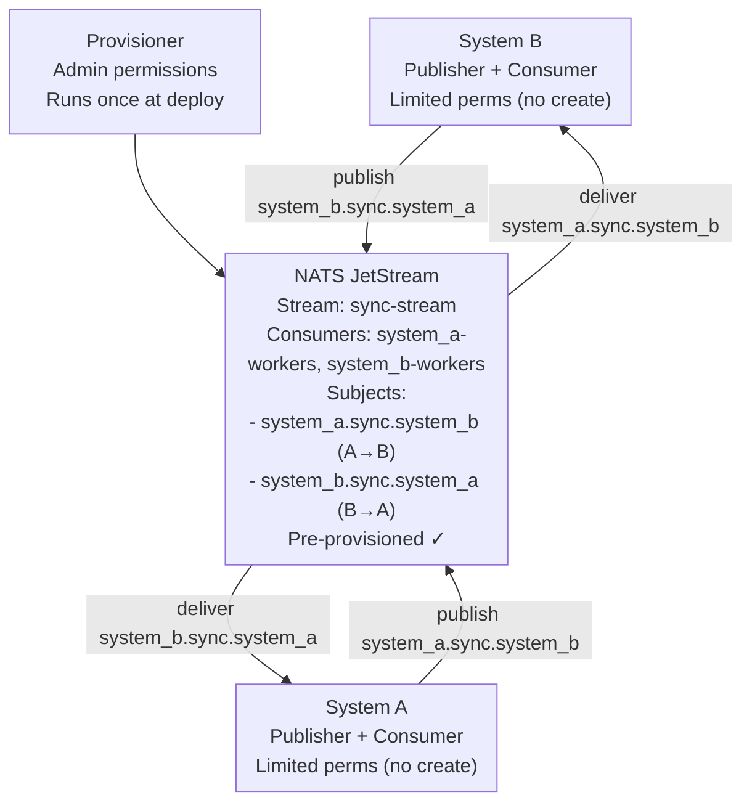

# Restrictive Environment Example

This example demonstrates syncing between two Rails 7 systems using JetStream Bridge in a **restrictive environment** where applications have LIMITED permissions and CANNOT create streams or consumers automatically.

## Architecture Overview



## Key Differences from Non-Restrictive Example

| Feature | Non-Restrictive | Restrictive |
|---------|----------------|-------------|
| **Auto-provisioning** | ✅ Enabled (`auto_provision: true`) | ❌ Disabled (`auto_provision: false`) |
| **Stream creation** | Apps create bidirectional streams on startup | Pre-provisioned by admin |
| **Consumer creation** | Apps create consumers on startup | Pre-provisioned by admin (both directions) |
| **App permissions** | Full admin access to NATS | Read/write only, no create |
| **Deployment** | Simple - apps self-configure | Requires provisioner step |
| **Use case** | Development, flexible environments | Production, locked-down environments |

## Why Restrictive Mode?

In production environments, you may want to:

- **Limit application permissions**: Apps shouldn't have admin access to create/delete streams
- **Separate concerns**: Infrastructure provisioning is separate from application deployment
- **Audit trail**: All topology changes go through a controlled provisioning process
- **Prevent accidents**: Apps can't accidentally delete or modify critical streams
- **Compliance**: Meet security requirements for least-privilege access

## How It Works

### 1. Provisioner Phase (One-Time)

The **provisioner** runs with **admin credentials** and:

- Connects to NATS JetStream
- Creates the stream with bidirectional subjects (A→B and B→A)
- Creates durable consumers for both systems
- Configures retention, limits, and policies

### 2. Application Phase (Runtime)

Applications run with **limited credentials** and:

- Cannot create or delete streams/consumers
- Can only publish to pre-existing subjects
- Can only subscribe to pre-existing consumers
- Both systems act as publishers and consumers
- Use `auto_provision: false` configuration

## Prerequisites

- Docker and Docker Compose
- curl (for testing)

### Host Ports (so you can run alongside the non-restrictive example)

- NATS client / HTTP monitoring: `localhost:5222` / `localhost:8822`
- System A API: `localhost:3100`
- System B API: `localhost:3101`
- Postgres A/B: `localhost:65432` / `localhost:65433`

## Quick Start

### 1. Start Services (Provisioner Runs First)

```bash
cd examples/restrictive
docker-compose up -d
```

**Important**: The provisioner service runs first and exits. Applications wait for it to complete before starting.

Startup order:

1. ✅ NATS JetStream starts
2. ✅ PostgreSQL databases start
3. ✅ **Provisioner runs and creates bidirectional topology**
4. ✅ System A starts (depends on provisioner)
5. ✅ System A Consumer starts
6. ✅ System B starts (depends on provisioner)
7. ✅ System B Consumer starts

### 2. Verify Provisioner Completed Successfully

```bash
# Check provisioner logs
docker-compose logs provisioner

# Should see:
# ✓ Connected to NATS JetStream
# ✓ Stream provisioned: sync-stream
# ✓ Provisioning completed successfully!
```

### 3. Verify Applications Started

```bash
# Check service status
docker-compose ps

# All services should be "Up" or "Exit 0" (provisioner)

# Check application logs
docker-compose logs system_a system_b_consumer
```

### 4. Run End-to-End Test

```bash
./test_sync.sh
```

This creates organizations and users in System A, then verifies they sync to System B.

## Manual Testing

### Create Organization

```bash
curl -X POST http://localhost:3100/organizations \
  -H "Content-Type: application/json" \
  -d '{
    "organization": {
      "name": "Acme Corp",
      "domain": "acme.com",
      "active": true
    }
  }'
```

### Verify Sync

```bash
# Wait a few seconds, then check System B
curl http://localhost:3101/organizations

# Check sync status
curl http://localhost:3101/sync_status
```

### Create User

```bash
curl -X POST http://localhost:3100/users \
  -H "Content-Type: application/json" \
  -d '{
    "user": {
      "organization_id": 1,
      "name": "Alice Smith",
      "email": "alice@acme.com",
      "role": "admin",
      "active": true
    }
  }'
```

### Verify User Synced

```bash
curl http://localhost:3101/users
```

## Provisioner Details

### What the Provisioner Creates

See [provisioner/provision.rb](provisioner/provision.rb) for the full script.

The provisioner creates:

1. **Stream**: `sync-stream`
   - Subjects: `system_a.sync.system_b` (A→B), `system_b.sync.system_a` (B→A)
   - Also includes DLQ subjects: `system_a.sync.dlq`, `system_b.sync.dlq`
   - Retention: Limits-based
   - Acknowledgment required

2. **Consumer**: `system_a-workers`
   - Durable pull consumer (receives from B)
   - Filter subject: `system_b.sync.system_a`
   - Ack policy: Explicit
   - Max deliver: 5
   - Ack wait: 30s
   - Backoff: [1s, 5s, 15s, 30s, 60s]

3. **Consumer**: `system_b-workers`
   - Durable pull consumer (receives from A)
   - Filter subject: `system_a.sync.system_b`
   - Ack policy: Explicit
   - Max deliver: 5
   - Ack wait: 30s
   - Backoff: [1s, 5s, 15s, 30s, 60s]

### Running Provisioner Manually

If you need to re-provision (after resetting NATS data):

```bash
# Stop all services
docker-compose down -v

# Start only NATS
docker-compose up -d nats

# Run provisioner
docker-compose up provisioner

# Start applications
docker-compose up -d system_a system_b_web system_b_consumer
```

### Provisioner as Standalone Script

You can also run the provisioner outside Docker:

```bash
cd examples/restrictive/provisioner

# Install dependencies
bundle install

# Set environment
export NATS_URL=nats://localhost:5222
export STREAM_NAME=sync-stream

# Run provisioner
ruby provision.rb
```

## Configuration Details

### System A Configuration

See [system_a/config/initializers/jetstream_bridge.rb](system_a/config/initializers/jetstream_bridge.rb)

Key differences from non-restrictive:

```ruby
config.auto_provision = false  # ← DISABLED (provisioner creates topology)
config.use_outbox = true       # Publisher functionality
config.use_inbox = true        # Consumer functionality
```

### System B Configuration

See [system_b/config/initializers/jetstream_bridge.rb](system_b/config/initializers/jetstream_bridge.rb)

Key differences from non-restrictive:

```ruby
config.auto_provision = false  # ← DISABLED (provisioner creates topology)
config.use_outbox = true       # Publisher functionality
config.use_inbox = true        # Consumer functionality
```

## Simulating Restricted Permissions

In this example, we simulate restricted permissions through deployment order:

1. Provisioner runs with full access
2. Applications start only after provisioning completes
3. Applications are configured with `auto_provision: false`

### In Real Production

To truly enforce restricted permissions in production:

1. **Create separate NATS users** with different permissions:

```bash
# Admin user (for provisioner)
nats account add ADMIN_USER --permission publish=">",subscribe=">",allow-pub-response

# App user (for System A)
nats account add SYSTEM_A_USER --permission publish="system_a.sync.>"

# App user (for System B)
nats account add SYSTEM_B_USER --permission subscribe="system_a.sync.system_b"
```

1. **Use different credentials** for provisioner vs applications:

```ruby
# Provisioner uses admin credentials
config.nats_urls = ENV['NATS_ADMIN_URL']  # with admin token

# Applications use limited credentials
config.nats_urls = ENV['NATS_APP_URL']  # with app token
```

1. **Test permission enforcement**:
   - Apps should fail if they try to create streams
   - Apps should succeed publishing/subscribing to pre-existing subjects

## Monitoring

### Verify Stream Exists

```bash
docker-compose exec nats nats stream info sync-stream
```

Output:

```text
Information for Stream sync-stream
...
Subjects: system_a.sync.system_b, system_b.sync.system_a,
          system_a.sync.dlq, system_b.sync.dlq
...
```

### Verify Consumers Exist

```bash
docker-compose exec nats nats consumer list sync-stream
```

Output:

```text
Consumers for Stream sync-stream:
  - system_a-workers (receives from B)
  - system_b-workers (receives from A)
```

### Check Consumer Status

Both consumers can be monitored:

```bash
# Check System A consumer (receives from B)
docker-compose exec nats nats consumer info sync-stream system_a-workers

# Check System B consumer (receives from A)
docker-compose exec nats nats consumer info sync-stream system_b-workers
```

Shows for each consumer:

- Messages delivered
- Messages pending
- Redelivery count
- Last activity

## Troubleshooting

### Provisioner Failed

```bash
# Check provisioner logs
docker-compose logs provisioner

# Common issues:
# - NATS not ready: Wait for nats service healthcheck
# - Connection refused: Check NATS_URL environment variable
# - Permission denied: In real production, check NATS user permissions
```

### Applications Won't Start

```bash
# Check if provisioner completed successfully
docker-compose ps provisioner
# Should show "Exit 0"

# If provisioner failed, applications will wait indefinitely
# Fix provisioner issue and restart:
docker-compose restart provisioner
docker-compose up -d system_a system_b_web system_b_consumer
```

### Events Not Syncing

```bash
# Check if consumer is running
docker-compose logs system_b_consumer

# Check if stream has messages
docker-compose exec nats nats stream info sync-stream

# Check if consumer is receiving
docker-compose exec nats nats consumer info sync-stream system_b-workers
```

### Re-provisioning After Changes

If you modify the topology (subjects, retention, etc.):

```bash
# Stop all services
docker-compose down -v

# Start from scratch
docker-compose up -d
```

## Deployment Workflow

### Development

```bash
# Start everything (including provisioner)
docker-compose up -d
```

### Production

```bash
# 1. Deploy infrastructure (one-time or during maintenance)
kubectl apply -f nats-deployment.yaml
kubectl apply -f provisioner-job.yaml  # Runs once

# 2. Wait for provisioner to complete
kubectl wait --for=condition=complete job/jetstream-provisioner

# 3. Deploy applications
kubectl apply -f system-a-deployment.yaml
kubectl apply -f system-b-deployment.yaml
```

### CI/CD Pipeline

```yaml
# Example GitLab CI
stages:
  - provision
  - deploy

provision_jetstream:
  stage: provision
  script:
    - kubectl apply -f k8s/provisioner-job.yaml
    - kubectl wait --for=condition=complete job/jetstream-provisioner
  when: manual  # Only run when topology changes

deploy_apps:
  stage: deploy
  script:
    - kubectl apply -f k8s/system-a.yaml
    - kubectl apply -f k8s/system-b.yaml
  needs:
    - provision_jetstream
```

## API Endpoints

Same as non-restrictive example:

### System A (Publisher)

- POST /organizations, PATCH /organizations/:id
- POST /users, PATCH /users/:id
- GET /organizations, /organizations/:id
- GET /users, /users/:id

### System B (Consumer)

- GET /organizations, /organizations/:id
- GET /users, /users/:id
- GET /sync_status

## Key Takeaways

1. **Separation of Concerns**: Infrastructure provisioning is separate from app deployment
2. **Security**: Applications run with minimal required permissions
3. **Reliability**: Pre-provisioned topology prevents race conditions
4. **Auditability**: All topology changes go through controlled process
5. **Production-Ready**: Matches real-world locked-down environments

## Comparison with Non-Restrictive

| Aspect | Non-Restrictive | Restrictive (This Example) |
|--------|----------------|----------------------------|
| Setup complexity | Simple | More complex |
| Deployment steps | 1 (start apps) | 2 (provision, then start apps) |
| Security posture | Apps have admin access | Apps have minimal access |
| Production readiness | Dev/staging | Production |
| Ops overhead | Low | Higher (manage provisioning) |
| Flexibility | High (apps self-configure) | Lower (requires provisioning step) |

For development and testing, use **non-restrictive**.
For production deployments, use **restrictive**.

## Cleanup

```bash
# Stop services
docker-compose down

# Remove volumes (deletes all data including NATS streams)
docker-compose down -v
```

## Next Steps

1. Review [provisioner/provision.rb](provisioner/provision.rb) to understand topology creation
2. Compare with [non-restrictive example](../non_restrictive/README.md) to see differences
3. Adapt provisioner script for your infrastructure (Kubernetes, Terraform, etc.)
4. Implement real NATS user permissions for true security enforcement
5. Add provisioner to your CI/CD pipeline
